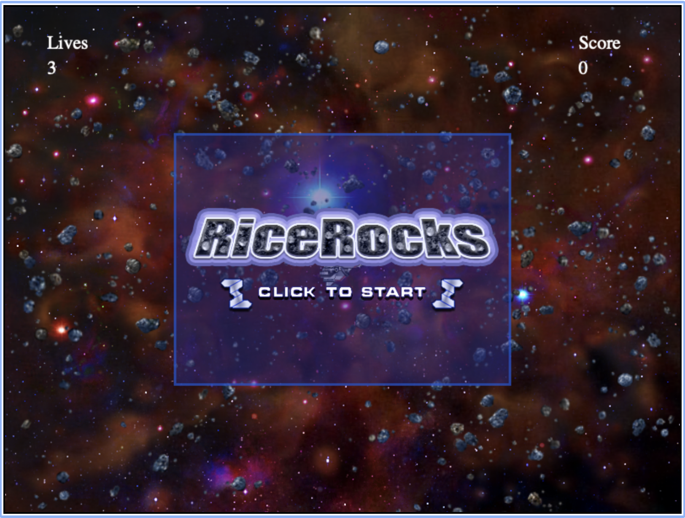
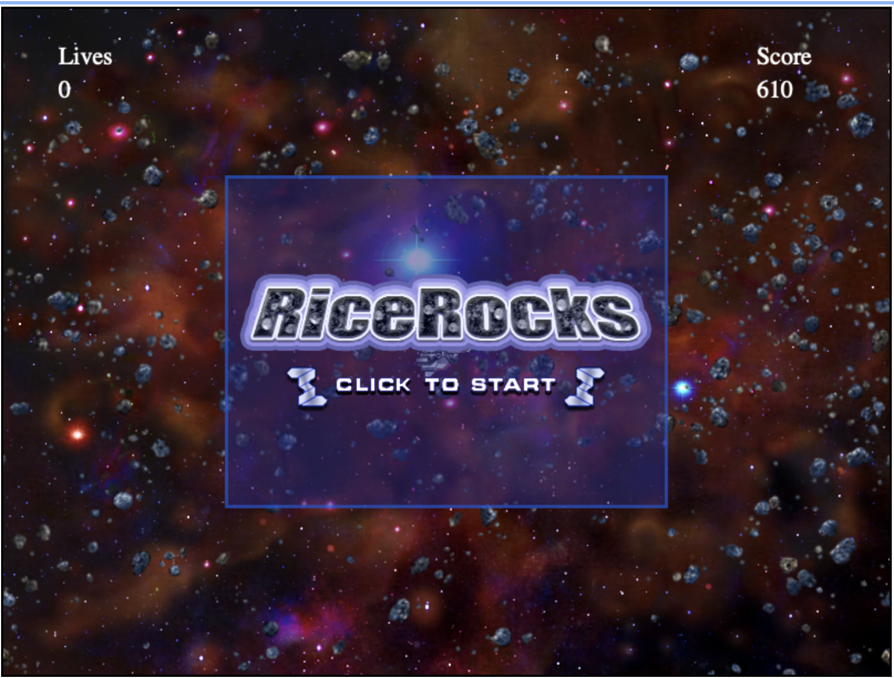
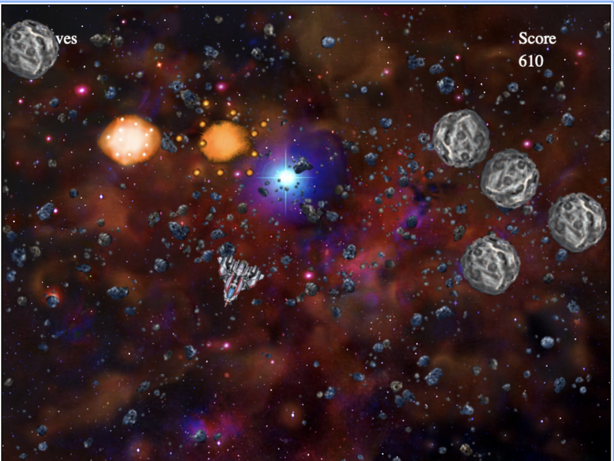
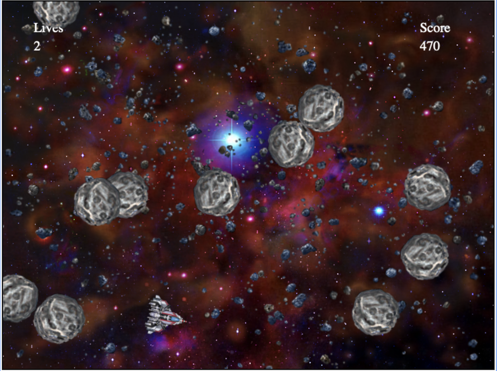
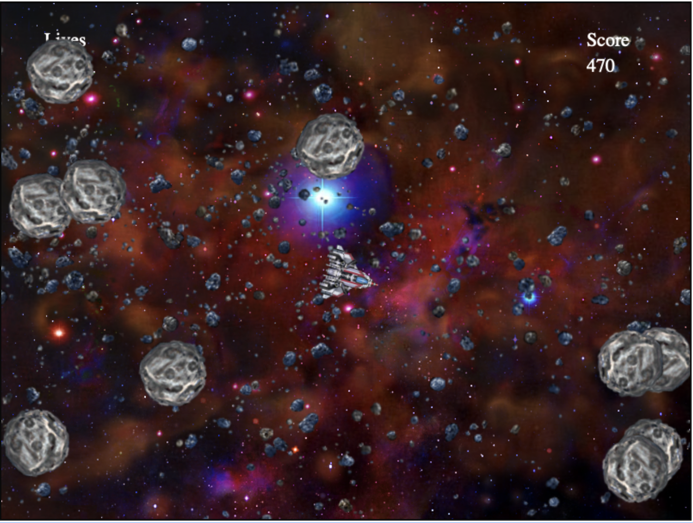
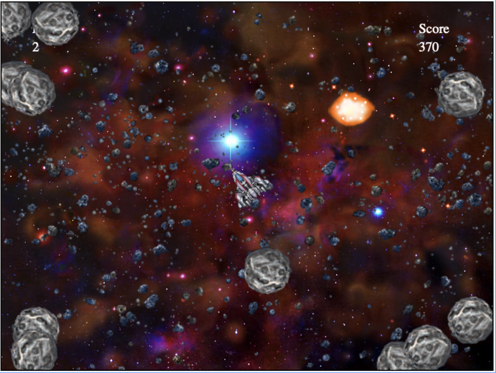

#  &nbsp; RiceRocks -

A take on the classic game [Asteroids](https://en.wikipedia.org/wiki/Asteroids_(video_game)), this project was built using Python as a part of the minor specialization in [Fundamentals of Computing using Python offered by Rice University, Texas](https://www.coursera.org/specializations/computer-fundamentals). An online IDE, named [CodeSkulptor](https://py2.codeskulptor.org/) was used for building this project. The GUI and sound were provided as a part of the course. Barring this, everything was coded from the ground up. It is a single player game wherein, there is a spaceship that is used to destroy asteroids in space by shooting bullets. The spaceship can be navigated in space via the Up, Down, Left and Right arrow keys. For shooting bullets space bar is used. The score of the player increases as and when an asteroid is destroyed, and each player has 3 lives in total. If the spaceship collides with the asteroid, a life is lost. You can find the implementation of the code [here](http://www.codeskulptor.org/#user47_xWqIal4M13pZTJc.py).

## Game Images -

 &nbsp;
 &nbsp;
 &nbsp;
 &nbsp;
 &nbsp;

Icons made by <a href="https://www.freepik.com" title="Freepik">Freepik</a> from <a href="https://www.flaticon.com/" title="Flaticon">www.flaticon.com</a>

